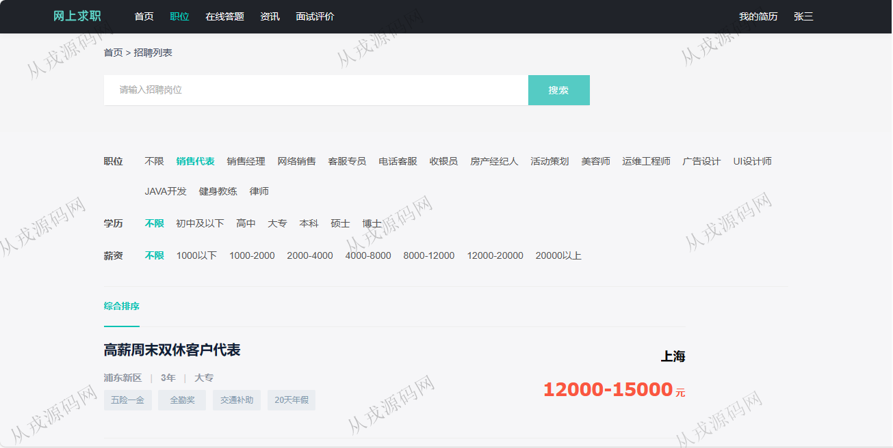
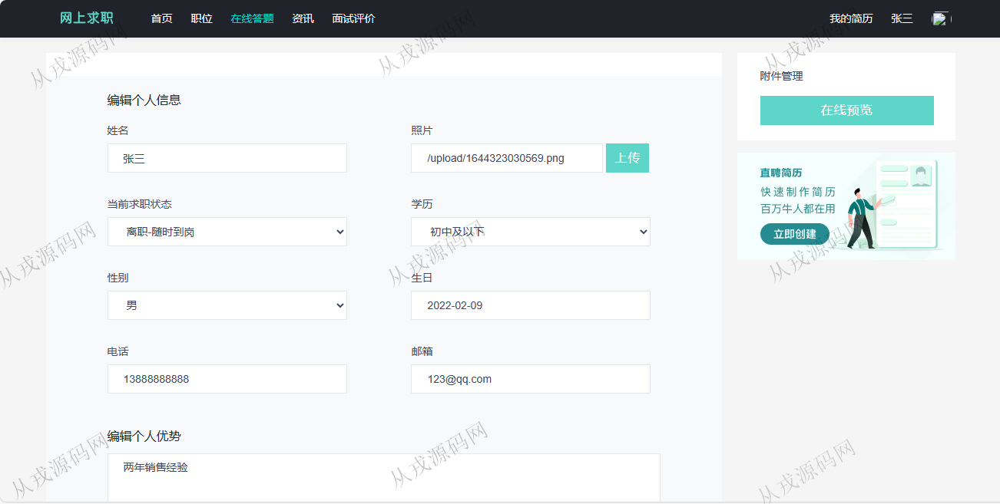
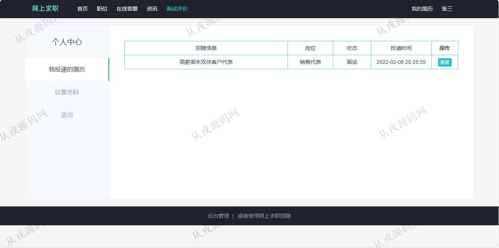
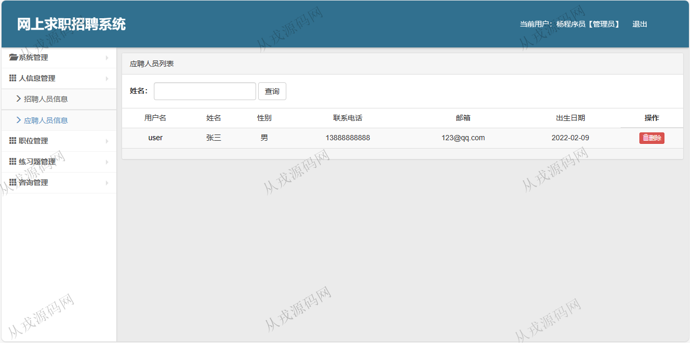
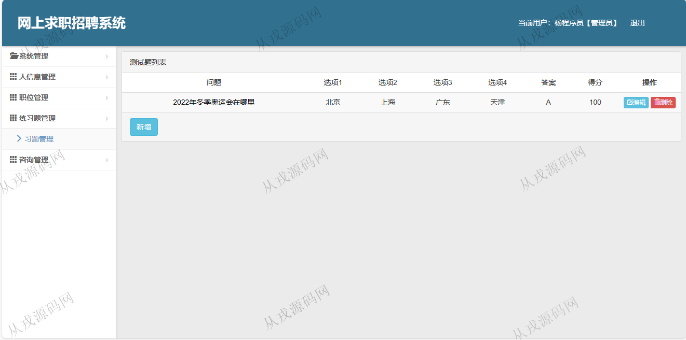
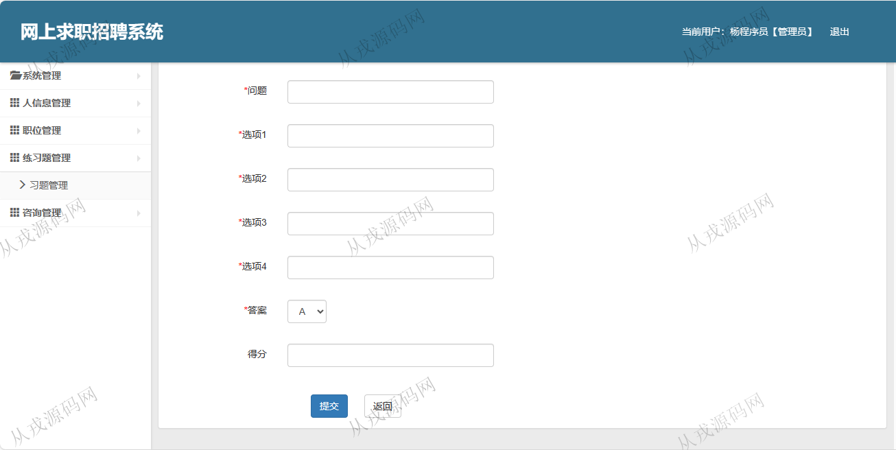
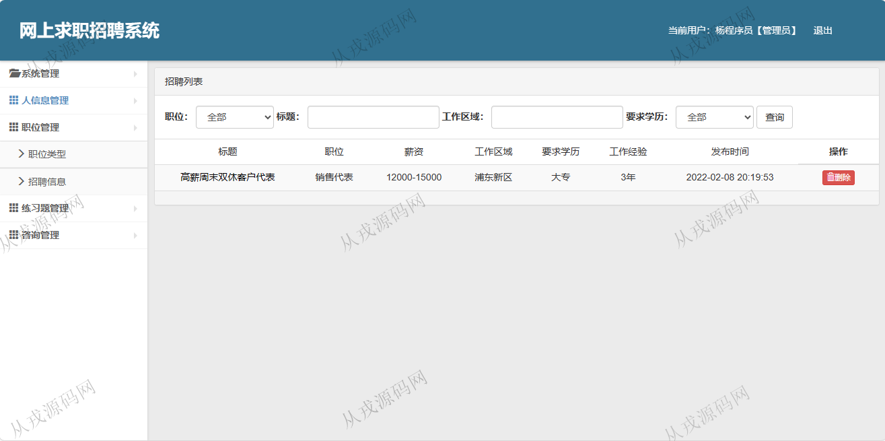

<h1 align="center">85.网上求职招聘管理系统</h1>

 获取sql文件 QQ: 386869957 QQ群: 377586148 

 [推荐站点: 从戎源码网](https://armycodes.com/) 

## 简介

> 本代码来源于网络,仅供学习参考使用!
>
> 提供1.远程部署/2.修改代码/3.设计文档指导/4.框架代码讲解等服务
>
> 前端首页: http://localhost:8080/index.action
>
> 前端登录: http://localhost:8080/web/login.jsp
>
> 用户: 用户名: user  密码: 123456
>
> 后端登录: http://localhost:8080/admin/login.jsp
>
> 管理员: 用户名: admin 密码: 123456
> 
> 招聘人员：hr 123456

## 项目介绍
基于ssm的网上求职招聘管理系统：前端 jsp、jquery，后端 springmvc、spring、mybatis，角色分为管理员、招聘人员、用户；集成职位发布，查看简历，简历编辑，在线投递等功能于一体的系统。

## 功能介绍

### 管理员

- 系统管理：管理员信息的增删改查，密码修改
- 人员信息管理：招聘人员的增删改查，应聘人员信息的列表查询，删除
- 职位管理：职位类型的增删改查，招聘信息的列表查询，删除
- 练习题管理：练习题的增删改查，练习题信息对应用户前台的答题页面
- 咨询管理：咨询信息的增删改查，多条件搜索查询

### 招聘人员

- 个人中心：个人信息的查看和修改，密码修改
- 职位管理：职位类型的增删改查，招聘信息的增删改查
- 查看投递简历：投递简历列表查询，面试结果操作，面试通过和不通过
- 收藏简历：简历收藏列表查询，查看简历详情，取消收藏

### 用户

- 基本功能：登录，注册，退出，密码修改
- 网站首页：全局搜索，职位类型导航，热招职位列表展示
- 职位：职位列表，职位详情
- 在线答题：在线练习，答题提交
- 资讯：资讯列表，资讯详情
- 面试评价：发布评价信息
- 我的简历：在线简历编辑，下载简历
- 我投递的简历：投递列表，面试通知

## 环境

- <b>IntelliJ IDEA 2021.3</b>

- <b>Mysql 5.7.26</b>

- <b>Tomcat 7.0.73</b>

- <b>JDK 1.8</b>

## 运行截图

